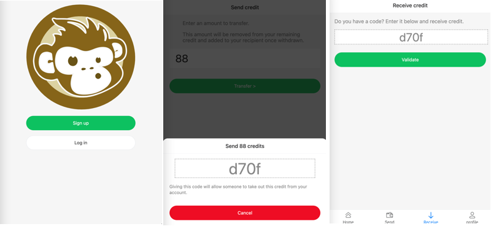

# monkeymoney

MonkeyMoney is a trading value system to promote local stores, individual exchanges, human services, trades…

You don't sell, you don't get paid. Instead you gain and spend credit exchanging services, food, goods.

The following 3 screenshots show you how to login, how to give credit and how to recieve them.



## Is MonkeyMoney a local currency?

The idea of the local currencies are close to MonkeyMoney as they both promote local purchases, small business and human exchanges.

However MonkeyMoney is not based on any currency.


## Is MonkeyMoney a [LETS](https://en.wikipedia.org/wiki/Local_exchange_trading_system)?

[A local exchange trading system](https://en.wikipedia.org/wiki/Local_exchange_trading_system) is also very similar to MonkeyMoney.

However MonkeyMoney is easier to trade for goods and to transfer credits.

It also has no boundaries, can be used by a very small group for a weekend on a trip or widely spread for long term among commercial values.

The name comes from the French expression "[Payer en monnaie de singe](https://fr.wikipedia.org/wiki/Payer_en_monnaie_de_singe)" (to pay with monkey money) meaning to pay with a money that can't be converted to a currency.

## Technical details

This part of the project is [PWA](https://developer.mozilla.org/en-US/docs/Web/Progressive_web_apps), client side and relies on a Restful API.

It's based on [NuxtJS](http://nuxtjs.org/) and connect to the [MonkeyMoney API](https://github.com/vinyll/MonkeyMoney-api).

It's meant to be cross-platform and run directly from a web browser.


## Build Setup

```bash
# install dependencies
$ yarn install

# serve with hot reload at localhost:3000
$ yarn dev

# build for production and launch server
$ yarn build
$ yarn start

# generate static project
$ yarn generate
```
